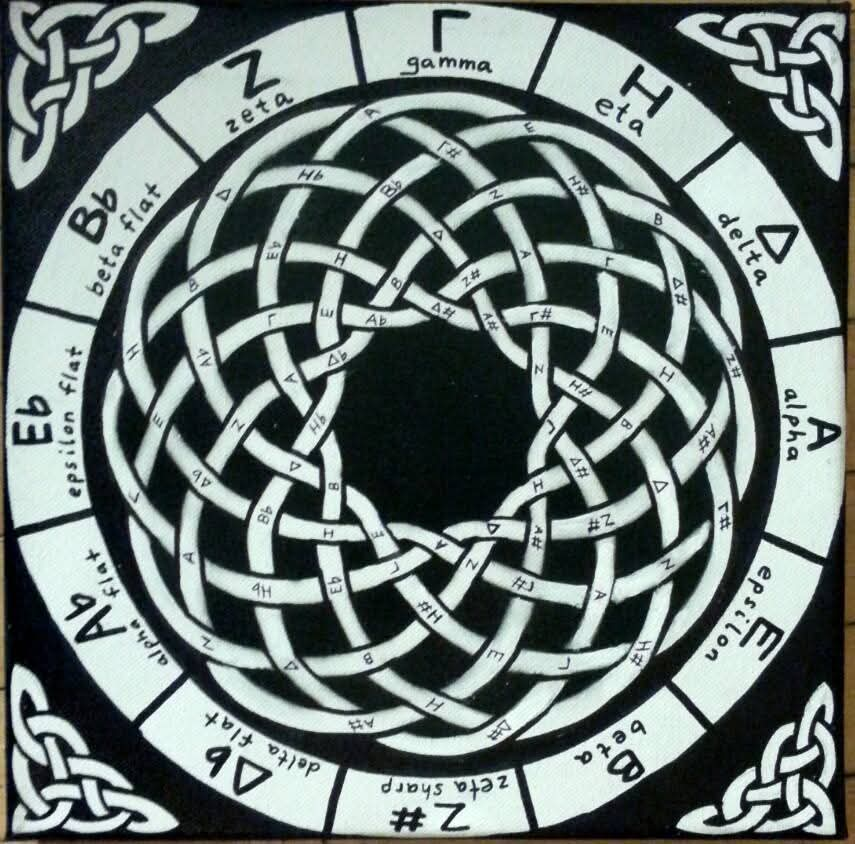

# Circle of Fifths Transposer

**Ergodic Music Design**

This project features an interactive **Circle of Fifths Transposer** that lets you visualize and transpose chord progressions with ease. Rotate the circle to change the key and watch the chord labels update automatically!

---

## Features

- **Interactive Visualization:** Displays major chords on an outer circle and their relative minor chords on an inner circle.
- **Dynamic Transposition:** Rotate the circle with simple controls to transpose chord progressions.
- **Chord Progressions:** Automatically updates popular progressions (e.g., I-IV-V, ii-V-I) based on the rotation.

---

## Screenshots

### Circle of Fifths


### Knot of Fifths


### Piano of Fifths


---

## How to Use

1. **Open the Demo:**  
   Simply open the `index.html` file in your favorite web browser.
2. **Interact:**  
   - Use the **Rotate Left** and **Rotate Right** buttons to adjust the circle.
   - Watch as the chord labels and transposed progressions update in real time.
3. **Understand the Layout:**  
   - The **outer circle** shows major chords.
   - The **inner circle** displays the corresponding relative minor chords.
   - Fixed labels (in red for majors and blue for minors) denote key positions like IV, I, and V.

---

## Code Overview

Below is a brief overview of the HTML structure used in the project:

```html
<!DOCTYPE html>
<html lang="en">
  <head>
    <meta charset="UTF-8">
    <meta name="viewport" content="width=device-width, initial-scale=1.0">
    <title>Circle of Fifths Transposer</title>
    <style>
      body { display: flex; flex-direction: column; align-items: center; font-family: Arial, sans-serif; }
      canvas { background-color: #fff; border: 1px solid #ccc; }
      #controls { margin-top: 10px; }
      button { padding: 10px; margin: 5px; }
      #progressionDisplay { margin-top: 15px; font-size: 18px; }
    </style>
  </head>
  <body>
    <h1>Circle of Fifths</h1>
    <br>
    <h1>Knot of Fifths</h1>
    <br>
    <h1>Piano of Fifths</h1>
    <br>
    
    <h2>Circle of Fifths Transposer</h2>
    <canvas id="circleCanvas" width="400" height="400"></canvas>
    <div id="controls">
      <button onclick="rotateCircle(-1)">Rotate Left</button>
      <button onclick="rotateCircle(1)">Rotate Right</button>
    </div>
    <div id="progressionDisplay"></div>
    
    <script>
      // JavaScript code for drawing the circles, handling rotation, and updating chord progressions
    </script>
    
    <h3>𝘕𝘰𝘵 𝘸𝘰𝘳𝘬𝘪𝘯𝘨 𝘺𝘦𝘵</h3>
  </body>
</html>
